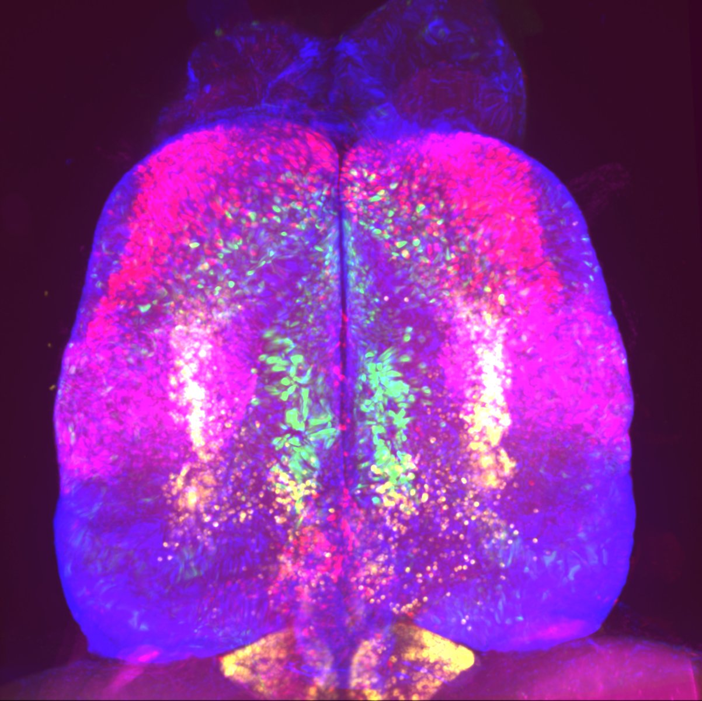

<p align="center">

</p>

# Analysis code for zebrafish telencephalon sequencing data
In this repository, we provide the analysis code for scRNA-seq and bulk sequencing data from zebrafish telencephalon.


## contents
- ./analysis/
  Analysis scripts.
  - 00_QC.R computes basic quality control values for the scRNA-seq dataset.
  - 01_ClusterAllCells.R performs normalization and high-level clustering of the cells, according to general standards the Seurat pipeline.
  - 02_SubclusterNeurons.R selects neuronal clusters and subclusters GABAergic and glutamatergic cell types.
  - 03_BulkSequencingAnalysis.R performs the DeSEQ2 pipeline for our bulk sequencing dataset, so that we identify DEGs for different pallial regions.
  - 04_BulkCorrelationAnalysis.R correlates the pallial regions and the neuronal cell types to establish potential regions of origion for the single cell types.
  - 05_GeneFamilyAnalysis.R calculates the expression of genes belonging to different gene families within our identified cell types.
  - 06_GeneInformationContent.R performs a Random Forest analysis with which we assess how informative different gene families are to retrieve the cell type structure of the dataset.
  - 07_NeuromodulatoryNetworks.R computes expression thresholds for GPCRs, calculates graph structures of distinct neuromodulatory networks, and performs dimensionality reduction on the neuromodulation-associated gene expression dataset.
  - 08_SAMapConservedGenes.R takes the output of the SAMap pipeline to extract conserved GPCRs and transcription factors.
  - 09_MuSiC.R uses the [MuSiC](https://xuranw.github.io/MuSiC/articles/MuSiC.html) package to deconvolve contributions of single cell types to the four pallial regions from which we have obtained bulk sequencing data. 
- ./data/
  Additional files necessary for analysis.

## data availability
  Data can be downloaded as indicated in the manuscript and from the SRA depository linked with the BioProject PRJNA964500

## read mapping
We used the transcriptome annotation provided by the [Lawson lab](https://www.umassmed.edu/lawson-lab/reagents/zebrafish-transcriptome/) (V4.3.2), 
which can be freely downloaded from the linked page. For more information, see [their publication](https://elifesciences.org/articles/55792). 
For mapping, we used the [STARsolo package](https://github.com/alexdobin/STAR/blob/master/docs/STARsolo.md). We copied the CellRanger whitelist 
for the 10x V3 chemistry (3M-february-2018.txt) to a local directory and mapped:

```
STAR \
--genomeDir /link/to/genome/STARindex.2.7.9a.BSgenome.Drerio.UCSC.danRer11.noAlt.Lawsone4.3.2.sjdb100/ \
--readFilesIn /link/to/fasta_files.fastq.gz \
--soloFeatures Gene Velocyto \
--soloType CB_UMI_Simple \
--soloCBwhitelist /link/to/CellRanger_3M_february_2018.txt \
--soloCBstart 1 --soloCBlen 16 --soloUMIstart 17 --soloUMIlen 12 --soloStrand Forward \
--outFileNamePrefix /STARsolo_2.7.9_3065F1/ \
--runThreadN 12 \
--readFilesCommand zcat \
--outSAMtype BAM SortedByCoordinate \
--outSAMattributes NH HI CR UR CB UB GX GN
```

## SAMap
We closely followed the [vignette](https://github.com/atarashansky/SAMap/blob/main/SAMap_vignette.ipynb) provided in the SAMap repository.
After obtaining blast mappings between zebrafish and bearded dragon, we run the following python code:
```
from samap.mapping import SAMAP
from samap.analysis import (get_mapping_scores, GenePairFinder, transfer_annotations,
                            sankey_plot, chord_plot, CellTypeTriangles,
                            ParalogSubstitutions, FunctionalEnrichment,
                            convert_eggnog_to_homologs, GeneTriangles)
from samalg import SAM
import pandas as pd    
from samap.utils import save_samap   

fn1    = 'lizard/Pogona_vitticeps_withAnnotation.h5ad'
fn2    = 'zebrafish/scdr_v2_withAnnotation.h5ad'

filenames = {'lz':fn1,'zf':fn2}   
sm = SAMAP(
        filenames,
        f_maps = '../maps/',
        keys = {'zf':'cluster','lz':'newcluster'},
        save_processed=False
)

sm.run(neigh_from_keys = {'lz':True,'zf':True}, ncpus=24)

# should finish with:
#<samalg.SAM object at 0x7f8ec2400050>
```

## session info
```
R version 4.2.1 (2022-06-23 ucrt)
Platform: x86_64-w64-mingw32/x64 (64-bit)
Running under: Windows 10 x64 (build 19045)

Matrix products: default

locale:
[1] LC_COLLATE=German_Germany.utf8  LC_CTYPE=German_Germany.utf8    LC_MONETARY=German_Germany.utf8 LC_NUMERIC=C                   
[5] LC_TIME=German_Germany.utf8    

attached base packages:
[1] grid      stats4    stats     graphics  grDevices utils     datasets  methods   base     

other attached packages:
 [1] ComplexHeatmap_2.12.1       randomForest_4.7-1.1        dendextend_1.16.0           clustree_0.5.0              ggraph_2.1.0               
 [6] ggpubr_0.4.0                ggplot2_3.4.3               Matrix_1.6-1                dplyr_1.0.10                SeuratObject_4.1.3         
[11] Seurat_4.3.0.1              pheatmap_1.0.12             RColorBrewer_1.1-3          tidyr_1.3.0                 DESeq2_1.36.0              
[16] SummarizedExperiment_1.26.1 Biobase_2.56.0              MatrixGenerics_1.8.1        matrixStats_0.62.0          GenomicRanges_1.48.0       
[21] GenomeInfoDb_1.32.4         IRanges_2.30.1              S4Vectors_0.34.0            BiocGenerics_0.42.0   
```

